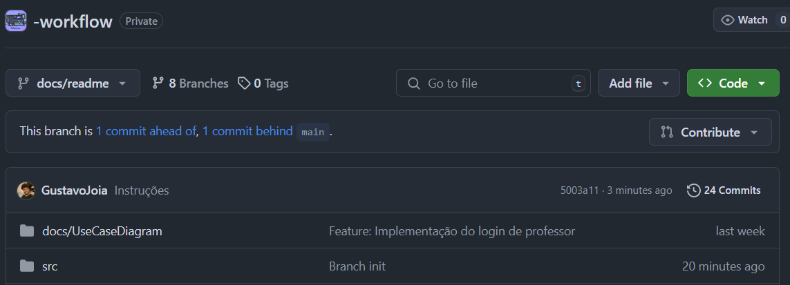

# Workflow

## Como fazer atualizações do projeto

### 1. Preparar o ambiente:

```sh
git init
git remote add origin https://github.com/DSM2SEM2024/-workflow.git
git config --local user.name "Seu nome"
git config --local user.email "Seu email DO GITHUB"
```
#

### 2. Baixar a ramificação (branch) principal, e criar uma nova ramificação
```sh
git pull origin main
git branch -m "prefixo/nome"
```

- feature/nome se for uma função/código
- docs/nome se for um documento
- fix/nome se for uma correção

Exemplo:
```sh
git branch -m feature/professor_repository
git branch -m docs/class_diagram
git branch -m fix/namespace
```

#

### 3. Após fazer suas alterações, adicionar com um comentário e subir a sua branch :)
```sh
git add *
git commit -m "Comentário do que você fez"
git push origin prefixo/nome
```

- Esse nome da branch tem que ser o mesmo que você definiu.

#

### 4. Crie um pull-request da branch que você criou depois de terminar tudo.

Isso você fará no próprio site do github, no repositorio da branch, no botão ***CONTRIBUTE*** e aguarde :D

